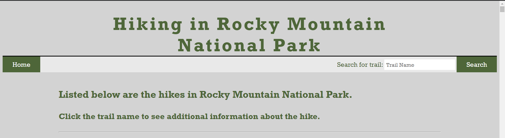

# Hiking Rocky Mountain National Park
> This hiking app includes info on the hikes with in Rocky Mountain National Park as well as assoicated YouTube videos of each hike.

## Link to Website
[Hiking RMNP](https://kirstink12.github.io/hiking-RMNP/)

## Screenshots

## Technologies
* Tech 1 - HTML
* Tech 2 - Javascript
* Tech 3 - CSS

## Summary
The purpose of this app is to be able to view all of the hikes within Rocky Mountain National Park with quick access to the top three hits on YouTube for the chosen hike name. From the main page you have access to a full list of each hike. With a click on the hike name it will toggle open with additional information and show the thumbnails for each YouTube video. Also from the main page, you can quickly find the hike you are looking for by using the search function.
